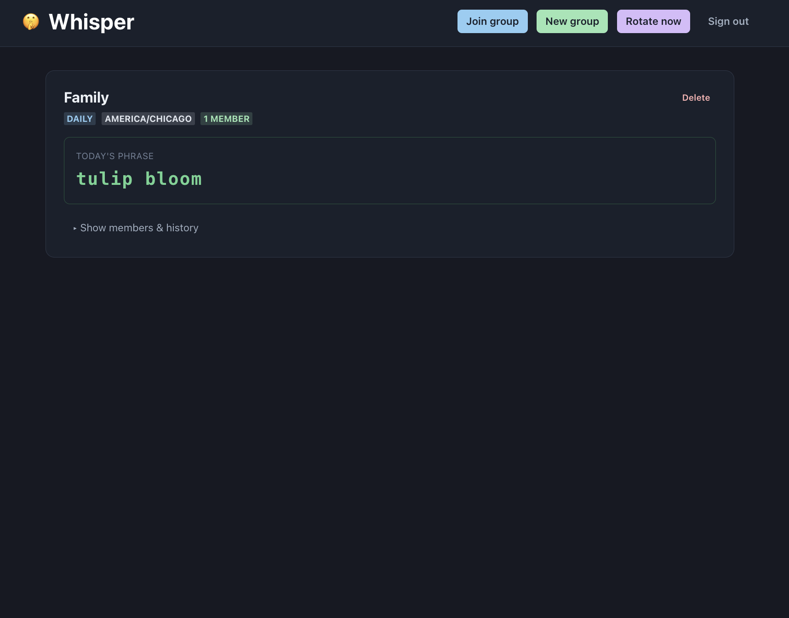
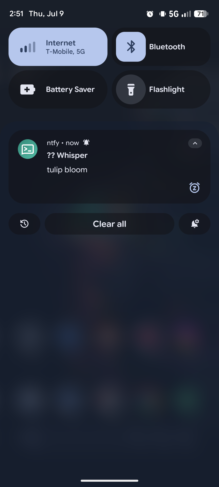

# Whisper

A shared daily safe-word for your people. Whisper generates a two-word phrase,
rotates it on a schedule (daily or weekly), and pushes it as a notification to
every member of a group. No app install. No accounts. No cost to run.

<p align="center">
  
  &nbsp;&nbsp;&nbsp;
  
</p>

## Use Cases

- Couple/family verification ("prove it's you on the phone")
- Child pickup authentication (only go with someone who knows today's word)
- Fun daily shared ritual between partners or friends

## How It Works

1. You add approved Gmail addresses to the allowlist.
2. Approved users log in with Google, create or join groups.
3. Each day (or week), a new two-word phrase is generated and pushed to every
   group member's phone via ntfy.sh.
4. Members can also see the current phrase by logging in to the web UI.

## Tech Stack

- **Java 21** (Spring Boot, Spring Security OAuth2, virtual threads) — core service, REST API, Google login
- **Rust** — word generator, called from Java via JNI. CSPRNG selection, no-repeat guarantee.
- **SQLite** — local file database. Groups, members, rotation history, email allowlist.
- **ntfy.sh** — free push notifications to phone, zero signup for recipients.
- **React + TypeScript** — web UI (login, create/join groups, view today's phrase + history).
- **Kubernetes** — Helm chart for self-hosters. Local dev via OrbStack/minikube.
- **OCI Always Free** — Production hosting on Oracle Cloud ARM VM ($0).

## Running Locally

Whisper runs as a single Java process calling a native Rust library. No Docker
or Kubernetes required. Works on macOS, Linux, and Windows.

### Prerequisites

- Java 21+ ([Corretto](https://aws.amazon.com/corretto/) or [Adoptium](https://adoptium.net/))
- Rust toolchain ([rustup.rs](https://rustup.rs/))
- Git

### Build

```bash
# Build the Rust word generator (produces a native shared library)
cd wordgen
cargo build --release
cd ..

# Build the Java service
cd service
./mvnw package -DskipTests   # macOS/Linux
mvnw.cmd package -DskipTests  # Windows
cd ..
```

The Rust build produces a platform-specific library:

| OS | File | Path |
|----|------|------|
| macOS | `libwhisper_wordgen.dylib` | `wordgen/target/release/` |
| Linux | `libwhisper_wordgen.so` | `wordgen/target/release/` |
| Windows | `whisper_wordgen.dll` | `wordgen\target\release\` |

### Configure

Copy `.env.example` to `.env` and fill in your values:

```bash
cp .env.example .env
```

```env
GOOGLE_CLIENT_ID=your-id.apps.googleusercontent.com
GOOGLE_CLIENT_SECRET=your-secret
SPRING_PROFILES_ACTIVE=oauth
WHISPER_ALLOWED_EMAILS=you@gmail.com,partner@gmail.com
```

For Google OAuth setup, create credentials at
[console.cloud.google.com/apis/credentials](https://console.cloud.google.com/apis/credentials)
with authorized redirect URI `http://localhost:8080/login/oauth2/code/google`.

Without a `.env` file, the app runs without authentication (useful for local testing).

### Run

**macOS / Linux:**
```bash
./run.sh
```

**Windows (PowerShell):**
```powershell
# Load .env manually
Get-Content .env | ForEach-Object {
    if ($_ -match '^([^#].+?)=(.*)$') {
        [Environment]::SetEnvironmentVariable($matches[1], $matches[2], "Process")
    }
}

java -D"java.library.path=.\wordgen\target\release" `
     -jar service\target\whisper-service-0.0.1-SNAPSHOT.jar
```

The service starts on `http://localhost:8080`.

### Schedule Daily Rotation

The app rotates phrases when `POST /api/rotate` is called. Set up a daily trigger:

**Windows (Task Scheduler):**
1. Open Task Scheduler → Create Basic Task
2. Name: "Whisper Rotate"
3. Trigger: Daily, at 8:00 AM
4. Action: Start a program
   - Program: `curl`
   - Arguments: `-sf -X POST http://localhost:8080/api/rotate`
5. Finish

**macOS / Linux (cron):**
```bash
# Add to crontab (crontab -e)
0 8 * * * curl -sf -X POST http://localhost:8080/api/rotate
```

### Run as a Background Service (Windows)

To keep Whisper running 24/7 on a Windows machine without a terminal window:

1. Install [NSSM](https://nssm.cc/download) (Non-Sucking Service Manager)
2. Run as admin:
```powershell
nssm install Whisper "C:\Program Files\Java\jdk-21\bin\java.exe" `
    "-Djava.library.path=C:\path\to\Whisper\wordgen\target\release" `
    "-jar" "C:\path\to\Whisper\service\target\whisper-service-0.0.1-SNAPSHOT.jar"
nssm set Whisper AppDirectory "C:\path\to\Whisper"
nssm set Whisper AppEnvironmentExtra "SPRING_PROFILES_ACTIVE=oauth" "GOOGLE_CLIENT_ID=..." "GOOGLE_CLIENT_SECRET=..." "WHISPER_ALLOWED_EMAILS=..."
nssm start Whisper
```

This survives reboots and runs without a visible console window.

## Status

✅ **Complete.** All three milestones shipped. See [DESIGN.md](DESIGN.md) for architecture details.

## License

MIT
